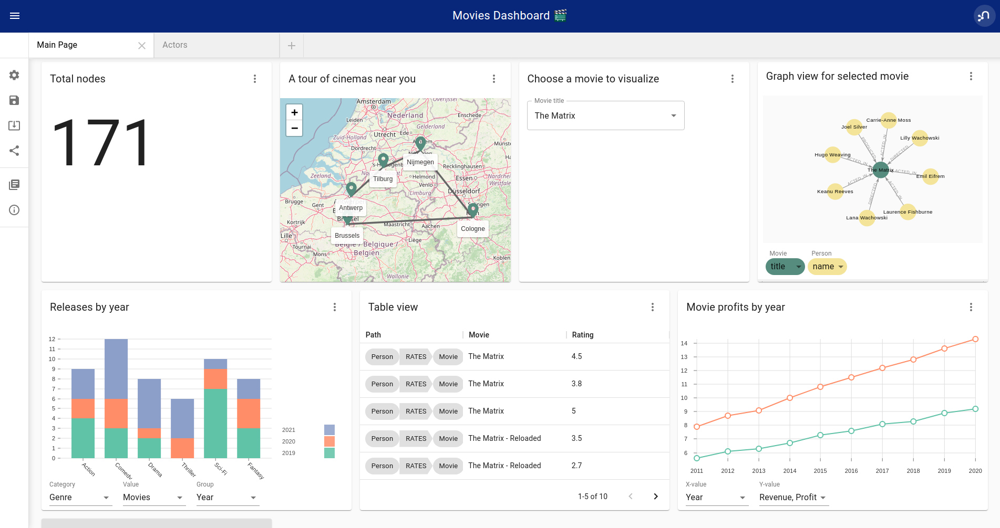

## NeoDash - Neo4j Dashboard Builder
NeoDash is an open source tool for visualizing your Neo4j data. It lets you group visualizations together as dashboards, and allow for interactions between reports. 

Neodash supports presenting your data as tables, graphs, bar charts, line charts, maps and more. It contains a Cypher editor to directly write the Cypher queries that populate the reports. You can save dashboards to your database, and share them with others.

## Running NeoDash
There are three ways to run the application:

1. You can install NeoDash into Neo4j Desktop from the [graph app gallery](https://install.graphapp.io). NeoDash will automatically connect to your active database.
2. You can run NeoDash from a web browser by visiting http://neodash.graphapp.io.
3. For offline deployments, you can build the application yourself. See the developer guide below.

# Developer Guide
## Run & Build
NeoDash is built with React. You'll need `npm` installed to run the web app.

To run the application in development mode:
- clone this repository.
- open a terminal and navigate to the directory you just cloned.
- execute `npm install` to install the necessary dependencies.
- execute `npm run dev` to run the app in development mode.
- the application should be available at http://localhost:3000.

To build the app for production:
- follow the steps above to clone the repository and install dependencies.
- execute `npm run build`. This will create a `build` folder in your project directory.
- deploy the contents of the build folder to a web server. You should then be able to run the web app.

 ## Extending NeoDash
 As of v2.0, NeoDash is easy to extend with your own visualizations. There are two steps to take to plug in your own charts:
 
###  1. Create the React component
All NeoDash charts implement the interface defined in `src/charts/Chart.tsx`. A custom chart must do the same. the following parameter as passed to your chart from the application:
- `records`: a list of Neo4j Records. This is the raw data returned from the Neo4j driver. 
- `settings`: a dictionary of settings as defined under "advanced report settings" for each report. You can use these values to customize your visualization based on user input.
- `selection`: a dictionary with the selection made in the report footer.
- `dimensions`: an array with the dimensions of the report (mostly not needed, charts automatically fill up space).
- `queryCallback`: a way for the report to read more data from Neo4j, on interactions.
- `setGlobalParameter`: a way for the report to set globally available Cypher parameters, on interactions.

Make sure that your component renders a React component. your component will be automatically scaled to the size of the report. See the other charts in `src/charts/` for examples. 

### 2. Extend the config to make your component selectable

To let users choose your visualization, you must add it to the app's report configuration. This config is located in `src/config/ReportConfig.tsx`, and defined by the dictionary `REPORT_TYPES`.

To add your visualization to the config, add a new key to the `REPORT_TYPES` dictionary with a unique name. The entry's value is an object which can contain the following fields:
- `label`: a display name for the visualization. Mandatory.
- `component`: the React component that renders the visualization. Mandatory.
- `helperText`: a string that is show under the query box in the report settings. Mandatory.
- `selection`: a list that contains each of the selection boxes present in the report footer. Optional.
- `settings`: a list of selection boxes that shows under the advanced settings. Optional.
- `maxRecords`: a hard limit on the number of records the visualization can handle. Mandatory.
- `useRecordMapper`: whether to use the in-built record mapper to fix your results in a specific format. Optional.
- `useNodePropsAsFields`: whether to use the node property selector as a report footer override. Optional.

If all works, please consider contributing your code to this repository.

## Questions / Suggestions
If you have any questions about NeoDash, please reach out. For feature requests, consider opening an issue(link) on GitHub.

